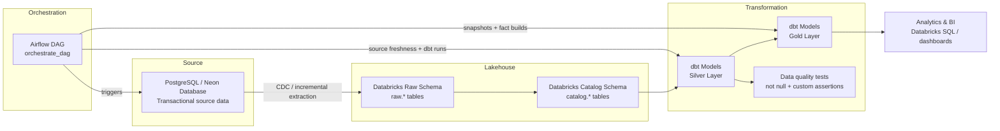

# Walmart Data Engineering Project

This project implements an end-to-end data engineering workflow for ingesting, transforming, testing, and orchestrating Walmart retail data across PostgreSQL, Databricks, and dbt. It models a modern medallion architecture with CDC-based incremental ingestion, curated silver layers, and analytics-ready gold tables.



## Overview

This repository demonstrates a production-style ELT pipeline where source systems feed into a cloud data lakehouse and then into a star/snowflake-style analytical model. The architecture separates raw ingestion, validation and transformation, and final curated analytics layers.

The pipeline includes:
- PostgreSQL or Neon as the transactional source system
- Databricks as the lakehouse and processing environment
- dbt for the silver and gold transformation layers
- Airflow for orchestration and scheduling
- CDC-driven incremental ingestion for efficient updates
- Data quality tests, source freshness checks, and snapshot-based historical tracking

## Business objective

The goal of this project is to build a reliable data platform that supports modern analytics for retail data domains such as customers, products, orders, stores, and employees. This enables downstream dashboards, KPIs, and trend analysis using clean and trusted data.

## Tech stack

- Python 3.12
- Apache Airflow 3.3.2
- Docker + Docker Compose
- PostgreSQL 16
- Redis 7.2
- Databricks SQL / Lakehouse
- dbt Core 1.12.x
- dbt-databricks adapter
- Databricks SDK

## Repository structure

```text
Walmart_Data_Engineer_Project/
├── README.md
├── pyproject.toml
├── uv.lock
├── main.py
├── .python-version
├── .gitignore
├── airflow/
│   ├── .env
│   ├── Dockerfile
│   ├── requirements.txt
│   ├── docker-compose.yaml
│   ├── dags/
│   │   └── orchestrate.py
│   ├── config/
│   ├── logs/
│   └── plugins/
├── walmart_project/
│   ├── .gitignore
│   ├── .user.yml
│   ├── README.md
│   ├── dbt_project.yml
│   ├── profiles.yml
│   ├── analyses/
│   ├── macros/
│   ├── models/
│   │   ├── source/
│   │   ├── silver_t/
│   │   ├── silver_b/
│   │   └── gold/
│   ├── snapshots/
│   ├── seeds/
│   ├── tests/
│   └── target/    # generated dbt artifacts
└── .vscode/
```

## Architecture and data flow

### 1. Source layer
The source system is PostgreSQL, with a Neon-based deployment model in many modern implementations. This stores transactional data such as customers, orders, products, stores, and employees.

### 2. Ingestion layer
A CDC-based approach captures incremental changes from the source database and loads them into Databricks. This allows the project to avoid full reprocessing on every run and keeps the pipeline efficient.

The Airflow DAG triggers the ingestion process and then validates freshness before continuing.

### 3. Databricks lakehouse layer
The Databricks workspace acts as the processing and storage backbone. Data lands in raw and catalog schemas before being transformed in dbt.

This project follows a medallion pattern:
- Raw: near-source, incremental loads
- Catalog: structured and contextualized source tables
- Silver: cleaned and standardized data
- Gold: curated analytical models and snapshots

### 4. Transformation layer (dbt)
dbt is used to implement the transformation logic with:
- Jinja templating
- source freshness checks
- model layering
- snapshots for slowly changing dimensions
- tests and validation assertions

The project organizes dbt models into the following groups:
- `silver_t`: technical cleansing, validation, and deduplication
- `silver_b`: business-layer transformations and domain logic
- `gold`: final curated analytical tables

### 5. Orchestration layer
Airflow is used to orchestrate the complete workflow:
- run ingestion task
- validate source freshness
- execute silver-tier dbt models
- run dbt tests
- build gold tables and snapshots
- manage dependencies and schedule

## Pipeline behavior

The main DAG file is `airflow/dags/orchestrate.py`.

The workflow defined there performs the following sequence:

1. Trigger CDC ingestion job in Databricks
2. Wait for completion and validate job success
3. Run `dbt source freshness`
4. Run `dbt run --select silver_t`
5. Run `dbt test --select silver_t`
6. Run `dbt run --select silver_b`
7. Run `dbt test --select silver_b`
8. Run `dbt run --select gold/ephemeral`
9. Run `dbt snapshot`
10. Run `dbt run --select gold/fact`

This pipeline is configured with a schedule of daily execution at 11:00 AM EST.

## dbt project structure

The dbt project is located in `walmart_project/` and includes the following important files:

- `dbt_project.yml`: project metadata and model configuration
- `profiles.yml`: Databricks connection profile
- `models/`: transformation logic
- `snapshots/`: historical SCD snapshots
- `tests/`: custom generic tests
- `macros/`: reusable SQL and Jinja utilities

### Snapshot strategy

The project uses dbt snapshots to track historical changes in dimensions such as:
- `dim_customers`
- `dim_employees`
- `dim_orders`
- `dim_products`
- `dim_stores`

These snapshots use a timestamp-based strategy and track validity windows with columns like:
- `dbt_valid_from`
- `dbt_valid_to`
- `dbt_scd_id`

This is a classic Slowly Changing Dimension Type 2 pattern.

## Data quality and testing

The project applies dbt tests to enforce quality and integrity:
- not null checks
- uniqueness checks
- relationship checks
- custom tests for positive values and key validation

Custom tests under `walmart_project/tests/custom_generic_test/` include:
- `Greater_than_0.sql`
- `not_null_primary.sql`

These tests help ensure the transformed tables are suitable for downstream analytics.

## Airflow setup

Airflow is configured using Docker Compose in `airflow/docker-compose.yaml`.

Key components:
- Airflow API server
- Scheduler
- DAG processor
- Celery worker
- Triggerer
- PostgreSQL metadata database
- Redis message broker

The custom image is built using `airflow/Dockerfile`, and the runtime dependencies are stored in `airflow/requirements.txt`.

## Dependency notes

The project dependencies are defined in:
- `pyproject.toml`
- `airflow/requirements.txt`

Current dependency stack includes:
- `apache-airflow`
- `dbt-core`
- `dbt-databricks`
- `databricks-sdk`
- `airflow-operators`

## Local setup

### Prerequisites
- Docker and Docker Compose
- Python 3.12
- Databricks workspace access
- PostgreSQL / Neon access

### Install dependencies

```bash
# with uv
uv sync

# or with venv
python -m venv .venv
source .venv/bin/activate
pip install -r airflow/requirements.txt
```

### Start Airflow

```bash
cd airflow
docker-compose up -d
```

Access the Airflow UI at:

```text
http://localhost:8080
```

Default credentials in the project configuration are:
- Username: `airflow`
- Password: `airflow`

### Run dbt locally

```bash
cd walmart_project
dbt debug

dbt run
dbt test
```

## Environment and secrets

Sensitive variables such as Databricks tokens and Airflow security keys should be stored in environment files and not committed to source control. The project includes:
- `airflow/.env`
- `walmart_project/profiles.yml`

These should be updated with your actual workspace URL, warehouse path, and credentials before running in a real environment.

## Why this project matters

This repository is a practical implementation of modern data engineering patterns used in enterprise analytics stacks:
- ETL/ELT orchestration
- incremental ingestion via CDC
- data quality enforcement
- medallion architecture
- analytics-ready transformations
- historical data tracking
- containerized deployment

## Conclusion

This project shows how a retail data pipeline can move from raw source tables in PostgreSQL to trusted and curated data products in Databricks using Airflow and dbt. It demonstrates strong engineering practices for orchestration, transformations, test coverage, and historical data management in a cloud lakehouse environment.

## Future enhancements

Potential next steps for the project include:
- add CI/CD automated validation
- implement alerts and notifications
- add incremental dbt models for larger datasets
- integrate more source systems
- add dashboarding and reporting layer
- expand source freshness and observability

---

This project is designed to serve as a learning and portfolio example for end-to-end data engineering using PostgreSQL, Databricks, dbt, and Airflow.
